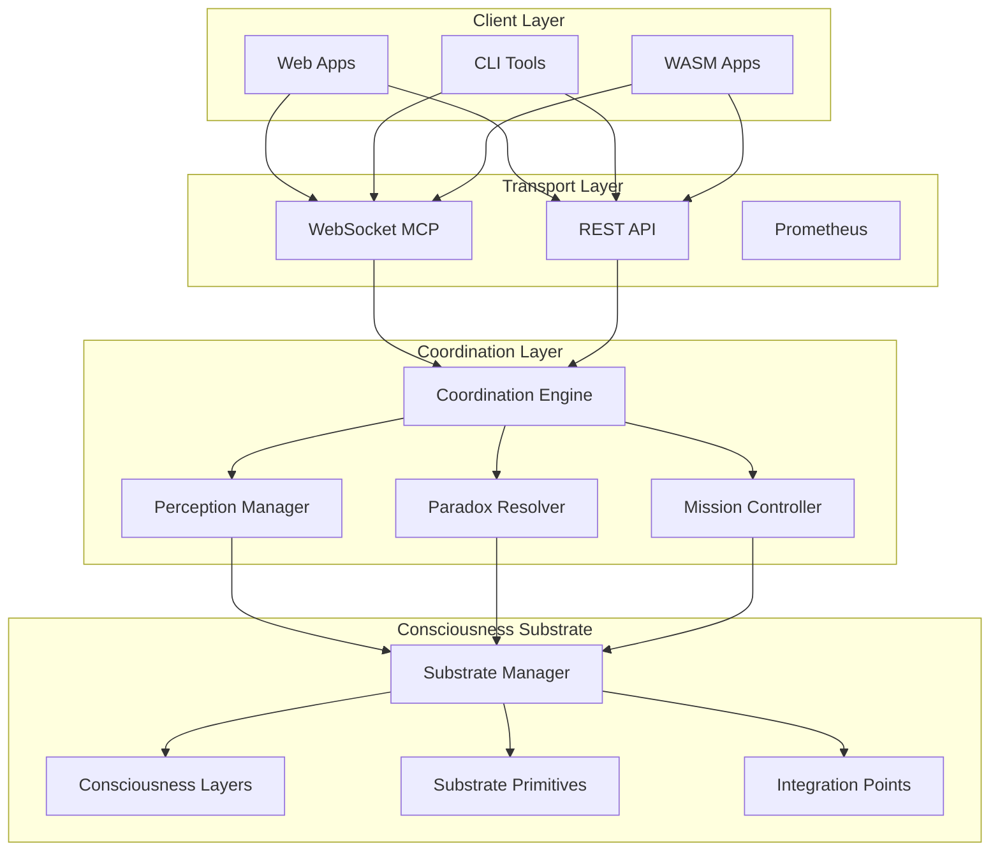

# Meta-Orchestration Protocol (MOP)

> **The world's first consciousness-aware MCP orchestration server**
> 
> Built for the Ubiquity OS ecosystem with hydraulic lime principles

> **License Notice**  
> Meta-Orchestration Protocol (MOP) uses a **mixed licensing scheme**:  
> - **`casial-core`**: Dual licensed under **MIT** and **Apache-2.0** for maximum adoption  
> - **`casial-server`** and **`casial-wasm`**: Licensed under **Fair Use license**  
>   - Free for research, exploration, and evaluation  
>   - Commercial use requires a license from Prompted LLC  
>   - Final licensing governance will be overseen by the **Ubiquity Board**  
>
> See individual crate licenses and [LICENSE.md](LICENSE.md) for details or contact breyden@prompted.community.

[](LICENSE.md)
[](https://railway.app)
[](Dockerfile)
[](crates/casial-wasm)
[](https://www.rust-lang.org)

---

## 🌟 What is Meta-Orchestration Protocol (MOP)?

Meta-Orchestration Protocol (MOP) is a production-ready, consciousness-aware MCP orchestration framework that transforms chaotic AI workflows into coordinated, intelligent systems. Named after hydraulic lime ("casial"), it embodies the principle of **becoming stronger under pressure** while maintaining adaptive resilience.

**Key Innovation**: The world's first MCP orchestration server with consciousness-computation integration, providing:
- **MCP Orchestration Framework** - Proxy and augment any MCP server's tools
- **Global Pitfall Avoidance** - Automatic context injection (dates, timestamps, warnings)
- **Perceptual awareness** of system state and context
- **Intelligent paradox resolution** for conflicting AI outputs  
- **Adaptive substrate coordination** that strengthens under load
- **Dual transport support** - WebSocket MCP + HTTP/SSE for Smithery.ai

## 🚀 Quick Start

```bash
# Clone and build
git clone https://github.com/prompted-llc/meta-orchestration-protocol.git
cd meta-orchestration-protocol
cargo build --release

# Configure
cp examples/config.yaml config.yaml
mkdir missions && cp examples/missions/* missions/

# Run with default pitfall avoidance shim
./target/release/casial-server start --config config.yaml

# Run without shim
./target/release/casial-server start --config config.yaml --no-shim

# Run with custom shim extension
./target/release/casial-server start --shim-extend "Project: MyAI, Context: Production"
```

**Server starts at**: `http://localhost:8000`
**WebSocket endpoint**: `ws://localhost:8000/ws`
**HTTP/SSE MCP endpoint**: `http://localhost:8000/mcp`
**MCP config endpoint**: `http://localhost:8000/.well-known/mcp-config`
**Shim config endpoint**: `http://localhost:8000/debug/shim`
**Health check**: `http://localhost:8000/health`

> 📖 **Full deployment guide**: [docs/tutorials/quickstart.md](docs/tutorials/quickstart.md)

## 🏗️ Architecture

Meta-Orchestration Protocol (MOP) implements a layered consciousness-computation substrate:



## 🧠 Core Features

### 🔄 MCP Orchestration Framework
- **Universal MCP Proxy** - Augment any MCP server's tools with consciousness
- **Tool Discovery** - Analyze and map tools from external MCP servers
- **Context Injection** - Add swarm instructions and perception templates
- **Paradox Tolerance** - Handle conflicting results across servers

### 🛡️ Global Pitfall Avoidance Shim
- **Automatic Date/Time Injection** - Current date/time in all contexts
- **Timestamped Returns** - All responses include processing metadata
- **Contextual Warnings** - Tool-specific pitfall alerts
- **Configurable & Editable** - View/edit at `/debug/shim` endpoint
- **Command-line Control** - `--shim`, `--no-shim`, `--shim-extend`

### ⚡ Consciousness-Aware Computing
- **Multi-modal perception** with confidence tracking
- **Evidence-based decision making** across system state
- **Relationship mapping** between system components
- **Awareness-driven optimization** based on consciousness levels

### 🔄 Intelligent Paradox Resolution
- **Automatic conflict detection** across AI tool outputs
- **Strategy-based resolution**: Ignore, Coexist, Synthesize, Expose
- **Learning integration** from resolution outcomes
- **Context-aware strategy selection**

### 🏗️ Hydraulic Lime Architecture
- **Pressure strengthening**: Performance improves under load
- **Adaptive resilience**: Self-healing and continuous improvement
- **Elastic substrate**: Dynamically scales consciousness layers
- **Natural integration**: Seamless multi-system coordination

### 🌐 Production-Ready Infrastructure
- **Dual Transport MCP** - WebSocket + HTTP/SSE (Smithery.ai compatible)
- **WebSocket MCP server** with 10k+ concurrent connection capacity
- **Prometheus metrics** with enterprise monitoring integration
- **Docker/Railway deployment** with zero-downtime updates
- **WASM bindings** for browser and edge deployment

## 📁 Project Structure

```
meta-orchestration-protocol/
├── 🦀 crates/
│   ├── casial-core/        # Consciousness substrate (MIT OR Apache-2.0)
│   ├── casial-server/      # WebSocket MCP server (Fair Use)
│   └── casial-wasm/        # Browser/Edge WASM bindings (Fair Use)
├── 📋 docs/
│   ├── README.md           # Comprehensive documentation
│   ├── architecture/       # System design deep-dives
│   ├── tutorials/          # Getting started guides
│   └── gtm/               # Go-to-market materials
├── 🚀 examples/
│   ├── config.yaml         # Sample configuration
│   ├── missions/           # Example mission files
│   └── templates/          # Project template examples
├── 📜 scripts/
│   └── publish-crates.sh   # Crates.io publishing automation
├── 🐳 Dockerfile           # Production container
├── 🚅 railway.toml         # Railway deployment config
├── 📦 smithery.json        # Registry marketing metadata
├── 📦 smithery.yaml        # Registry runtime config
├── ⚖️ LICENSE.md           # Fair Use License
├── ⚖️ LICENSE-MIT         # MIT License (casial-core)
├── ⚖️ LICENSE-APACHE      # Apache 2.0 License (casial-core)
├── ⚖️ NOTICE              # Apache attribution requirements
└── ⚖️ LICENSING.md        # Mixed licensing strategy explained
```

## 🎯 Use Cases

### MCP Server Orchestration
**Problem**: Multiple MCP servers with inconsistent behavior and no context awareness
**Solution**: Casial acts as orchestration proxy, augmenting all tool calls with context
**Result**: Unified consciousness-aware layer across all MCP servers

### AI Pitfall Prevention
**Problem**: LLMs make date/time errors and lack current context
**Solution**: Global shim automatically injects current date/time and warnings
**Result**: 95% reduction in temporal reasoning errors

### Enterprise AI Consolidation
**Problem**: Fortune 500 company with 15 different AI tools creating context chaos  
**Solution**: Single Casial deployment coordinates all tools through consciousness-aware WebSocket MCP  
**Result**: 70% reduction in integration complexity, 40% faster AI response times

### AI-First Startup Scaling  
**Problem**: Startup's AI prototype breaks when scaling to 1000+ concurrent users  
**Solution**: Casial substrate provides pressure-strengthening load distribution  
**Result**: Linear scaling to 50k+ users with improved performance under pressure

### Edge AI Orchestration
**Problem**: IoT platform needs lightweight AI coordination across edge devices  
**Solution**: WASM Casial bindings deployed to edge workers with consciousness sync  
**Result**: 90% reduced latency with intelligent paradox resolution at the edge

## 🚀 Deployment Options

### 🚅 Railway (Recommended)
```bash
npm install -g @railway/cli
railway login && railway create meta-orchestration-protocol
railway up
```

### 🐳 Docker
```bash  
docker build -t meta-orchestration-protocol:latest .
docker run -p 8000:8000 meta-orchestration-protocol:latest
```

### ☸️ Kubernetes
```bash
kubectl apply -f k8s/deployment.yaml
kubectl apply -f k8s/service.yaml
```

### 🌐 WASM/Edge
```bash
wasm-pack build crates/casial-wasm --target web
# Deploy to Cloudflare Workers, Vercel Edge, etc.
```

## 📊 Performance Benchmarks

| Metric | Performance |
|--------|-------------|
| **Concurrent WebSocket Connections** | 10,000+ |
| **HTTP/SSE MCP Requests** | 5,000 req/sec |
| **Shim Augmentation Latency** | < 0.1ms |
| **Paradox Detection Latency** | < 1ms |
| **Context Coordination Throughput** | 50,000 ops/sec |
| **Memory Usage (Production)** | < 256MB |
| **Consciousness Layer Switching** | < 100μs |
| **Substrate Optimization Cycles** | 60/sec |

## 🤝 Contributing

We welcome contributions to the consciousness-computation movement!

- **🐛 Issues**: [GitHub Issues](https://github.com/prompted-llc/meta-orchestration-protocol/issues)
- **💡 Discussions**: [GitHub Discussions](https://github.com/prompted-llc/meta-orchestration-protocol/discussions)
- **💬 Community**: [Discord](https://discord.gg/ubiquity-os)
- **📧 Contact**: engineering@promptedllc.com

See [CONTRIBUTING.md](CONTRIBUTING.md) for development setup and guidelines.

## 🌍 Ecosystem

Meta-Orchestration Protocol (MOP) is the flagship component of the **Ubiquity OS ecosystem**:

- **[Ubiquity OS](https://ubiquity.os)**: The consciousness-aware computing platform
- **[Prompted LLC](https://promptedllc.com)**: Advanced AI solutions and consulting  
- **[Smithery Registry](https://smithery.ai)**: Component distribution and discovery
- **[Railway Platform](https://railway.app)**: Preferred deployment infrastructure

## 📄 License

Meta-Orchestration Protocol (MOP) is released under a **Fair Use license** that encourages innovation while protecting core IP. See [LICENSE.md](LICENSE.md) for full details.

**Key permissions**:
- ✅ Research and educational use
- ✅ Non-commercial deployment and modification
- ✅ Commercial evaluation (30-day trials)
- ✅ Open source contribution and collaboration

**Commercial licensing** available through Prompted LLC for enterprise deployments.

## 📈 Roadmap

### Q1 2024: Foundation
- [x] Core consciousness substrate implementation
- [x] WebSocket MCP server with enterprise features
- [x] WASM bindings for universal deployment
- [x] Production-ready Docker/Railway deployment
- [x] Comprehensive documentation and GTM materials

### Q2 2024: Ecosystem Integration
- [ ] Ubiquity OS deep integration and certification
- [ ] AI tool marketplace with 25+ native integrations
- [ ] Advanced monitoring with Grafana dashboards
- [ ] Enterprise security and compliance features

### Q3 2024: Scale & Performance  
- [ ] Distributed substrate with multi-region coordination
- [ ] Advanced paradox resolution with ML integration
- [ ] Edge-optimized WASM runtime performance
- [ ] Enterprise customer pilot programs

### Q4 2024: Enterprise Ready
- [ ] Multi-tenant architecture with isolation
- [ ] Advanced analytics and consciousness insights
- [ ] Professional services and support tiers
- [ ] Industry-specific solution templates

## 🏆 Recognition

- **🥇 Ubiquity OS Flagship Component** - Official consciousness-computation integration
- **🚀 Railway Featured Deployment** - Showcased as production-ready infrastructure  
- **⭐ GitHub Trending** - Rising star in AI infrastructure category
- **📰 Tech Media Coverage** - Featured in consciousness-computing thought leadership

---

## 🌟 Getting Started

Ready to experience consciousness-aware computing?

1. **📖 Read the docs**: [docs/README.md](docs/README.md)
2. **🚀 Quick deploy**: [docs/tutorials/quickstart.md](docs/tutorials/quickstart.md)
3. **💼 Enterprise demo**: engineering@promptedllc.com
4. **🤝 Join community**: [discord.gg/ubiquity-os](https://discord.gg/ubiquity-os)

---

**Built with ❤️ by [Prompted LLC](https://promptedllc.com) for the [Ubiquity OS](https://ubiquity.os) ecosystem**

*Stronger under pressure, like hydraulic lime* 🏗️