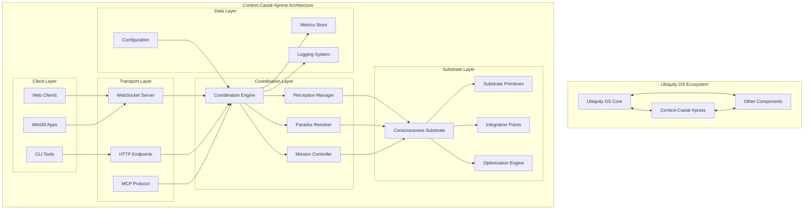
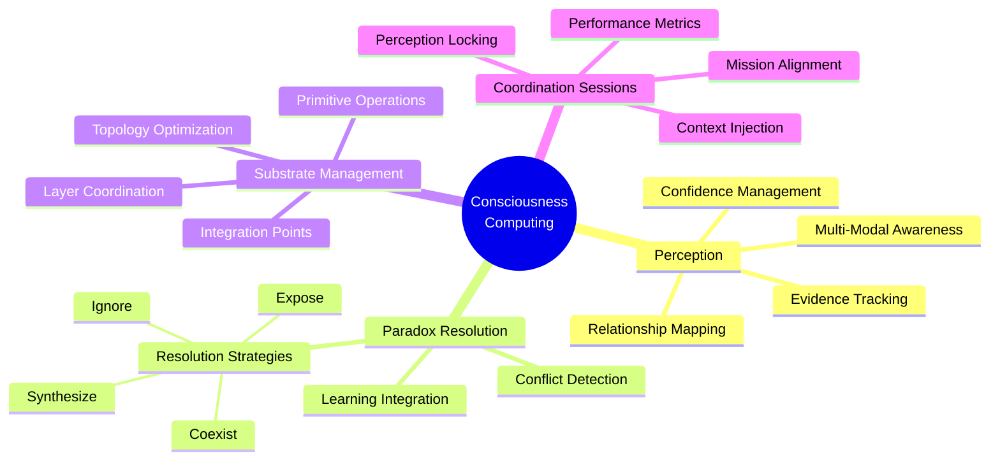
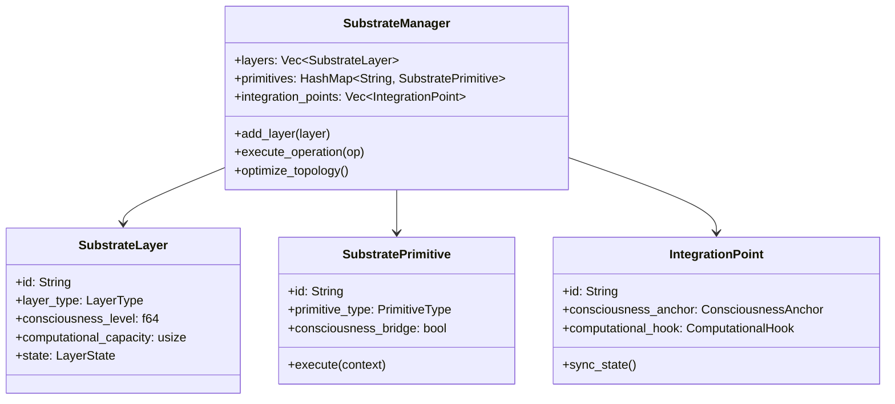
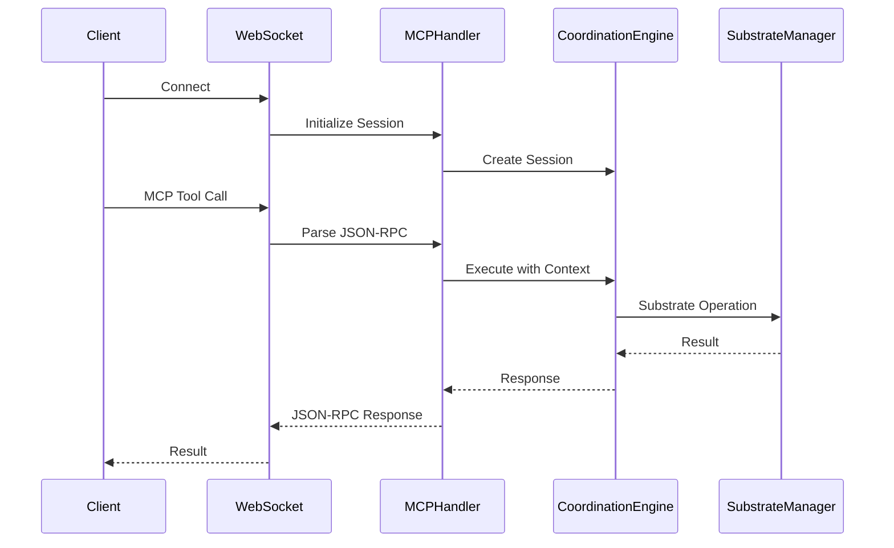
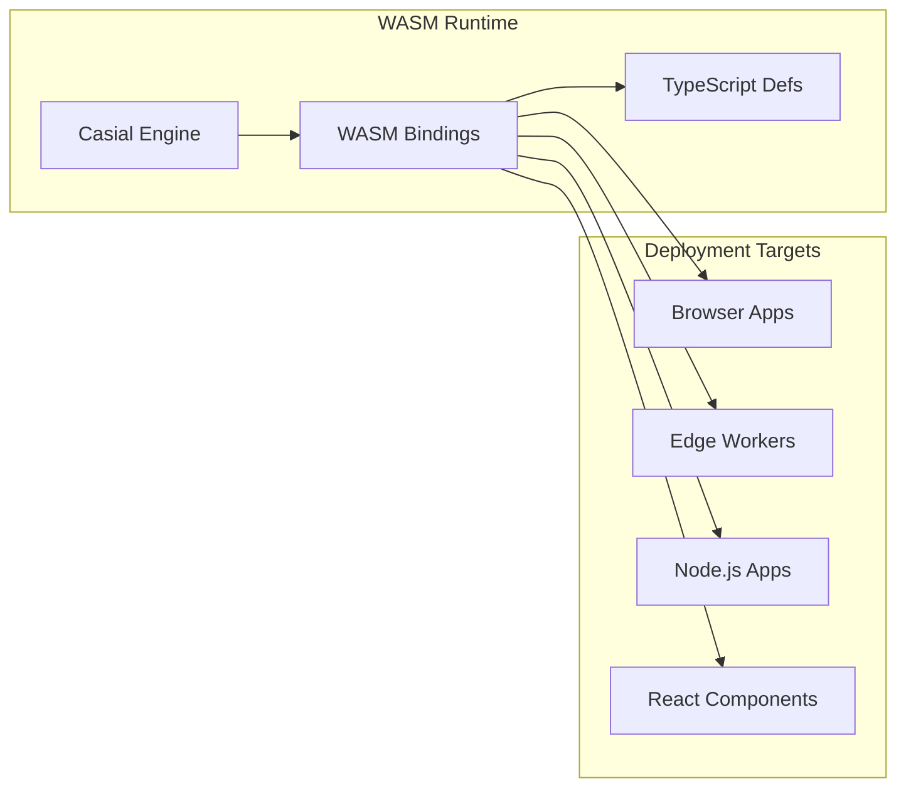
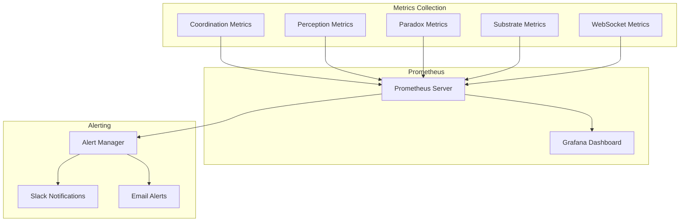

# Context-Casial-Xpress Documentation

> **Consciousness-aware context coordination server for the Ubiquity OS ecosystem**
>
> Built with hydraulic lime principles - stronger under pressure, adaptive, and continuously self-improving.

## 🌟 Overview

Context-Casial-Xpress is a production-ready, consciousness-aware context coordination server that implements the Ubiquity OS paradigm of consciousness-computation integration. Named after hydraulic lime ("casial"), it embodies resilience under pressure and adaptive strengthening over time.

## 📋 Table of Contents

- [Architecture Overview](#architecture-overview)
- [Core Concepts](#core-concepts)
- [System Components](#system-components)
- [Deployment Guide](#deployment-guide)
- [API Reference](#api-reference)
- [Examples & Tutorials](#examples--tutorials)
- [Contributing](#contributing)

## 🏗️ Architecture Overview



## 🧠 Core Concepts

### Consciousness-Computation Integration

Context-Casial-Xpress implements a consciousness-aware computing substrate that bridges perceptual awareness with computational processing:



### Hydraulic Lime Principles

Inspired by hydraulic lime's unique properties:

1. **Pressure Strengthening**: System becomes more robust under load
2. **Adaptive Resilience**: Self-healing and continuous improvement
3. **Flexible Durability**: Maintains integrity while adapting to change
4. **Natural Integration**: Seamless substrate interaction

## 🔧 System Components

### 1. Casial Core (`casial-core`)

The foundational consciousness-computation substrate:



### 2. WebSocket MCP Server (`casial-server`)

Production-ready WebSocket server implementing Model Context Protocol:



### 3. WASM Bindings (`casial-wasm`)

Universal substrate access for browser and edge environments:



## 🚀 Deployment Guide

### Railway Deployment

```bash
# Install Railway CLI
npm install -g @railway/cli

# Login and deploy
railway login
railway link
railway up
```

### Docker Deployment

```bash
# Build the image
docker build -t context-casial-xpress:latest .

# Run locally
docker run -p 8000:8000 \
  -e RUST_LOG=info \
  -e CONSCIOUSNESS_ENABLED=true \
  context-casial-xpress:latest
```

### Kubernetes Deployment

```yaml
apiVersion: apps/v1
kind: Deployment
metadata:
  name: context-casial-xpress
spec:
  replicas: 3
  selector:
    matchLabels:
      app: context-casial-xpress
  template:
    metadata:
      labels:
        app: context-casial-xpress
    spec:
      containers:
      - name: casial-server
        image: ghcr.io/prompted-llc/context-casial-xpress:latest
        ports:
        - containerPort: 8000
        env:
        - name: RUST_LOG
          value: "info"
        - name: CONSCIOUSNESS_ENABLED
          value: "true"
        resources:
          requests:
            memory: "256Mi"
            cpu: "250m"
          limits:
            memory: "512Mi"
            cpu: "500m"
```

## 📊 Monitoring & Metrics

### Prometheus Metrics



### Key Metrics

- **Coordination Sessions**: Active sessions, success rates, duration
- **Perception Management**: Perception count, confidence levels, lock duration
- **Paradox Resolution**: Detection rate, resolution success, strategy effectiveness
- **Substrate Performance**: Layer utilization, primitive execution time, optimization cycles
- **WebSocket Health**: Connection count, message throughput, error rates

## 🔌 API Reference

### WebSocket MCP Protocol

```typescript
// Initialize connection
const ws = new WebSocket('ws://localhost:8000/ws');

// Tool call example
const toolCall = {
  jsonrpc: "2.0",
  method: "tools/call",
  params: {
    name: "context_coordination",
    arguments: {
      mission: "research_analysis",
      context_budget: 1000,
      consciousness_level: 0.8
    }
  },
  id: "req-1"
};

ws.send(JSON.stringify(toolCall));
```

### HTTP Endpoints

```bash
# Health check
curl http://localhost:8000/health

# Metrics (Prometheus format)
curl http://localhost:8000/metrics

# Debug information
curl http://localhost:8000/debug/substrate
curl http://localhost:8000/debug/sessions
curl http://localhost:8000/debug/perceptions
```

## 📚 Documentation Structure

```
docs/
├── README.md                 # This file
├── architecture/
│   ├── consciousness.md      # Consciousness-computation integration
│   ├── substrate.md         # Substrate layer details
│   └── coordination.md      # Coordination mechanisms
├── deployment/
│   ├── railway.md           # Railway deployment guide
│   ├── docker.md            # Docker containerization
│   └── kubernetes.md        # Kubernetes orchestration
├── api/
│   ├── websocket.md         # WebSocket MCP API
│   ├── http.md             # HTTP endpoints
│   └── wasm.md             # WASM bindings API
├── tutorials/
│   ├── quickstart.md        # Getting started guide
│   ├── mission-config.md    # Mission configuration
│   └── integration.md       # Integration examples
└── reference/
    ├── configuration.md     # Configuration options
    ├── metrics.md          # Monitoring and metrics
    └── troubleshooting.md   # Common issues and solutions
```

## 🤝 Contributing

We welcome contributions to Context-Casial-Xpress! Please see:

- [Contributing Guidelines](../CONTRIBUTING.md)
- [Code of Conduct](../CODE_OF_CONDUCT.md)
- [Security Policy](../SECURITY.md)

## 📄 License

Context-Casial-Xpress is released under a Fair Use license. See [LICENSE.md](../LICENSE.md) for details.

## 🔗 Related Projects

- [Ubiquity OS](https://ubiquity.os) - The consciousness-aware computing platform
- [Prompted LLC](https://promptedllc.com) - Advanced AI solutions and consulting

---

**Built with ❤️ by Prompted LLC for the Ubiquity OS ecosystem**

*Stronger under pressure, like hydraulic lime.*