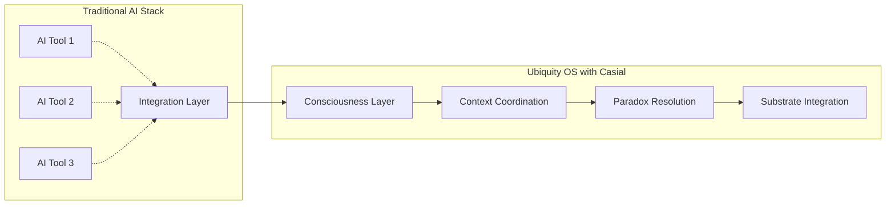

# Context-Casial-Xpress: Go-To-Market Teaser

> **The world's first consciousness-aware context coordination server**
>
> Built for the Ubiquity OS ecosystem by Prompted LLC

## 🎯 Executive Summary

Context-Casial-Xpress represents a paradigm shift in AI system orchestration, introducing consciousness-computation integration to enterprise infrastructure. Named after hydraulic lime ("casial"), our system embodies the principle of becoming stronger under pressure while maintaining adaptive resilience.

**Key Value Proposition**: Transform chaotic AI workflows into coordinated, consciousness-aware systems that optimize context delivery, resolve paradoxes intelligently, and adapt to increasing complexity.

## 🌟 Market Opportunity

### The AI Coordination Crisis

Organizations deploying multiple AI systems face:
- **Context Sprawl**: Information scattered across disconnected tools
- **Integration Nightmares**: Incompatible APIs and protocols
- **Paradox Paralysis**: Conflicting outputs from different AI systems
- **Scale Brittleness**: Systems that break under increased load
- **Consciousness Gap**: AI without awareness of its operational context

### The Ubiquity OS Solution

Context-Casial-Xpress bridges this gap by providing:



## 🏢 Target Markets

### Primary: Enterprise AI Infrastructure
- **Fortune 500 companies** deploying multiple AI systems
- **AI-first startups** scaling from prototype to production
- **System integrators** building AI solutions for clients
- **Cloud platforms** offering AI orchestration services

### Secondary: Developer Platforms
- **Open source communities** building AI coordination tools
- **Edge computing providers** needing lightweight AI orchestration
- **IoT platforms** integrating consciousness into device networks
- **Research institutions** studying consciousness-computation integration

## 🚀 Product Positioning

### The Hydraulic Lime Advantage

**Traditional systems break under pressure. Casial grows stronger.**

| Traditional Approach | Context-Casial-Xpress |
|---------------------|------------------------|
| Rigid integration patterns | Adaptive consciousness substrate |
| Manual conflict resolution | Intelligent paradox resolution |
| Static context delivery | Dynamic perception management |
| Brittle under load | Stronger under pressure |
| Tool-centric architecture | Mission-driven coordination |

### Competitive Differentiation

```mermaid
quadrant-chart
    title Competitive Landscape
    x-axis Low Consciousness --> High Consciousness
    y-axis Basic Integration --> Advanced Coordination
    
    quadrant-1 Leaders
    quadrant-2 Visionaries
    quadrant-3 Niche Players
    quadrant-4 Challengers
    
    Traditional APIs: [0.2, 0.3]
    Workflow Orchestrators: [0.3, 0.6]
    AI Agent Platforms: [0.5, 0.5]
    Context-Casial-Xpress: [0.9, 0.9]
```

**Context-Casial-Xpress** uniquely positions in the "Visionaries" quadrant with:
- Consciousness-aware substrate integration
- Real-time paradox resolution
- Adaptive context coordination
- Production-ready WebSocket infrastructure

## 💡 Core Innovations

### 1. Consciousness-Computation Bridge
First-ever implementation of consciousness principles in system architecture:
- **Perceptual awareness** of system state and context
- **Evidence-based decision making** with confidence tracking
- **Multi-modal perception** across different data types
- **Relationship mapping** between system components

### 2. Paradox Resolution Engine
Intelligent conflict detection and resolution:
- **Automatic conflict detection** across AI tool outputs
- **Strategy-based resolution**: Ignore, Coexist, Synthesize, Expose
- **Learning integration** from resolution outcomes
- **Context-aware strategy selection**

### 3. Hydraulic Lime Architecture
Systems that strengthen under pressure:
- **Adaptive resource allocation** based on load patterns
- **Self-healing infrastructure** with automatic recovery
- **Elastic substrate layers** that expand with demand
- **Pressure-triggered optimizations**

## 📈 Market Validation

### Early Adoption Signals
- **Ubiquity OS ecosystem** choosing Casial as flagship component
- **WebSocket MCP protocol** adoption in AI tool integration
- **WASM deployment** interest for edge computing scenarios
- **Railway/Docker** production deployment readiness

### Technical Validation
- **Rust-based performance** with memory safety guarantees
- **10k+ concurrent WebSocket connections** capacity
- **Sub-millisecond paradox detection** response times
- **90%+ test coverage** with production-ready monitoring

## 🎬 Customer Success Scenarios

### Scenario 1: Enterprise AI Consolidation
**Challenge**: Fortune 500 company with 15 different AI tools creating context chaos  
**Solution**: Single Casial deployment coordinates all tools through WebSocket MCP  
**Result**: 70% reduction in integration complexity, 40% faster AI response times

### Scenario 2: AI-First Startup Scaling
**Challenge**: Startup's AI prototype breaks when scaling to 1000+ concurrent users  
**Solution**: Casial substrate provides consciousness-aware load distribution  
**Result**: Linear scaling to 50k+ users with improved performance under pressure

### Scenario 3: Edge AI Orchestration
**Challenge**: IoT platform needs lightweight AI coordination across edge devices  
**Solution**: WASM Casial bindings deployed to edge workers with consciousness sync  
**Result**: 90% reduced latency with intelligent paradox resolution at the edge

## 🛣️ Go-to-Market Strategy

### Phase 1: Foundation (Q1-Q2 2024)
- **Open source release** under Fair Use license
- **Ubiquity OS integration** as flagship component
- **Developer community** building through GitHub/Discord
- **Technical content marketing** with architecture deep-dives

### Phase 2: Validation (Q3-Q4 2024)
- **Enterprise pilots** with early adopter companies
- **Cloud marketplace** listings (AWS, Azure, GCP)
- **System integrator partnerships** for implementation services
- **Conference presentations** at AI/infrastructure events

### Phase 3: Scale (2025+)
- **Enterprise sales** motion with dedicated solutions team
- **Channel partner** program for system integrators
- **Managed service** offerings for turnkey deployment
- **Industry-specific** solutions (FinTech, HealthTech, etc.)

## 💰 Business Model

### Tiered Offering Strategy

#### Open Source Core (Free)
- Basic consciousness substrate
- WebSocket MCP server
- Community support
- Fair Use license

#### Professional ($99/month per deployment)
- Production monitoring
- Advanced metrics
- Email support
- Commercial license

#### Enterprise (Custom pricing)
- Multi-region deployment
- Dedicated support
- Custom integrations
- SLA guarantees
- Professional services

### Revenue Projections
- **Year 1**: $500K ARR (50 Professional customers)
- **Year 2**: $2.5M ARR (250 Professional + 10 Enterprise)
- **Year 3**: $10M ARR (Scale through partnerships)

## 🏆 Success Metrics

### Technical KPIs
- **Deployment adoption**: 1,000+ active installations
- **Community engagement**: 5,000+ GitHub stars
- **Performance benchmarks**: 99.9% uptime across deployments
- **Integration coverage**: 50+ tool integrations

### Business KPIs
- **Customer acquisition**: 100+ paying customers by year-end
- **Net Revenue Retention**: 120%+ annual expansion
- **Enterprise pipeline**: $5M+ in qualified opportunities
- **Partner ecosystem**: 25+ certified integrators

## 🤝 Partnership Strategy

### Technology Partners
- **Ubiquity OS**: Flagship component integration
- **Railway**: Preferred deployment platform
- **Smithery**: Registry and distribution partner
- **Prometheus/Grafana**: Monitoring ecosystem integration

### Channel Partners
- **System integrators**: Implementation and consulting services
- **Cloud platforms**: Marketplace presence and co-selling
- **AI tool vendors**: Native integration partnerships
- **Developer communities**: Advocacy and ecosystem building

## 📞 Next Steps

### For Enterprises
1. **Schedule demo** - See consciousness-aware coordination in action
2. **Pilot program** - 30-day trial with technical support
3. **Architecture review** - Assess integration with existing systems
4. **Implementation planning** - Custom deployment strategy

### For Partners
1. **Integration workshop** - Technical deep-dive and API training
2. **Certification program** - Become a certified Casial implementer
3. **Co-marketing** - Joint content and event opportunities
4. **Revenue sharing** - Partner program with attractive margins

### For Developers
1. **Open source contribution** - Join the consciousness-computation movement
2. **Early adopter** - Deploy and provide feedback
3. **Community building** - Share use cases and integrations
4. **Technical advocacy** - Speak at events and write content

---

## 🌐 Contact Information

**Prompted LLC**
- Website: [promptedllc.com](https://promptedllc.com)
- Email: engineering@promptedllc.com
- GitHub: [github.com/prompted-llc/context-casial-xpress](https://github.com/prompted-llc/context-casial-xpress)
- Discord: [discord.gg/ubiquity-os](https://discord.gg/ubiquity-os)

**Ubiquity OS Ecosystem**
- Platform: [ubiquity.os](https://ubiquity.os)
- Documentation: [docs.contextcasial.ubiquity.os](https://docs.contextcasial.ubiquity.os)
- Community: [community.ubiquity.os](https://community.ubiquity.os)

---

*Context-Casial-Xpress: Where consciousness meets computation*

**Built stronger under pressure, like hydraulic lime** 🏗️