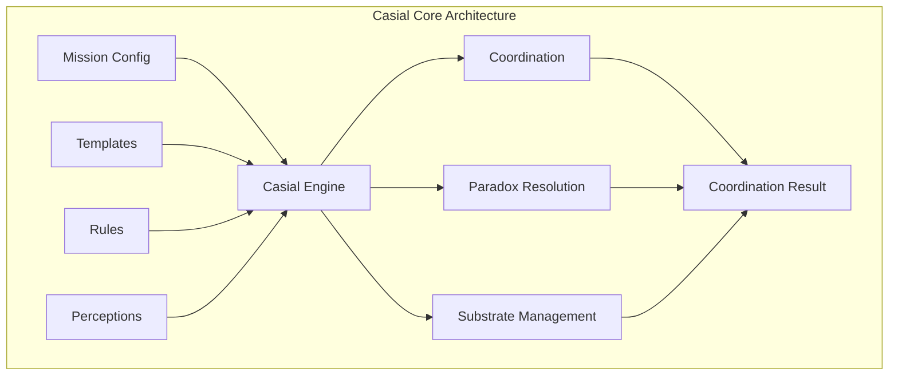

# casial-core

[](https://crates.io/crates/casial-core)
[](https://docs.rs/casial-core)
[](#license)
[](https://crates.io/crates/casial-core)

**Consciousness-aware context coordination engine** - The foundational substrate for paradox-resilient AI agent context management and coordination.

## Overview

`casial-core` provides the foundational consciousness-computation substrate for Context-Casial-Xpress. This crate implements:

- **Consciousness Substrate**: Multi-layer perception coordination with awareness tracking
- **Perception Management**: Evidence-based perception handling with confidence scores
- **Paradox Resolution**: Intelligent conflict detection and resolution strategies
- **Context Coordination**: Mission-driven template selection and context injection
- **Substrate Integration**: Consciousness-computation bridge with performance optimization

## Features

- **Memory Safety**: 100% safe Rust with no unsafe blocks
- **High Performance**: Optimized data structures with ahash and parking_lot
- **Serialization**: Full serde support for all data structures
- **WASM Compatible**: Can be compiled to WebAssembly for browser/edge deployment
- **Well Tested**: Comprehensive test coverage with property-based testing

## Usage

Add this to your `Cargo.toml`:

```toml
[dependencies]
casial-core = "0.1.4"
```

Basic example:

```rust
use casial_core::{CasialEngine, CasialMission, CoordinationRequest};

// Create a new consciousness-aware engine
let mut engine = CasialEngine::new();

// Load a mission configuration
let mission = CasialMission::load_from_file("mission.yaml")?;
engine.load_mission(mission)?;

// Coordinate context with consciousness awareness
let request = CoordinationRequest {
    tool_name: "web_search_exa".to_string(),
    tool_args: serde_json::json!({"query": "AI research trends"}),
    environment: std::env::vars().collect(),
    project_path: Some("./".to_string()),
    active_perceptions: vec![],
    paradox_tolerance: 0.8,
};

let result = engine.coordinate(request)?;
println!("Coordinated context: {}", result.injected_content);
```

## Architecture



## License

**Dual Licensed**: MIT OR Apache-2.0

`casial-core` is dual-licensed under the MIT License and Apache License 2.0. You may use this crate under the terms of either license.

### Why Dual License?

The core substrate is dual-licensed to:

- **Maximize Adoption**: MIT license for maximum compatibility
- **Patent Protection**: Apache 2.0 for patent grant protections  
- **Ecosystem Integration**: Support both permissive and copyleft projects
- **Commercial Friendly**: No restrictions on commercial use

### License Files

- [MIT License](../../LICENSE-MIT)
- [Apache License 2.0](../../LICENSE-APACHE)  
- [NOTICE](../../NOTICE) - Attribution requirements for Apache 2.0

## Attribution

When using `casial-core`:

```text
This product includes Context-Casial-Xpress Core, developed by Prompted LLC
(https://promptedllc.com) as part of the Ubiquity OS ecosystem.
```

## Contributing

We welcome contributions to `casial-core`! By contributing, you agree to license your contributions under both MIT and Apache-2.0 licenses.

- **Issues**: [GitHub Issues](https://github.com/prompted-llc/context-casial-xpress/issues)
- **Discussions**: [GitHub Discussions](https://github.com/prompted-llc/context-casial-xpress/discussions)
- **Contributing Guide**: [CONTRIBUTING.md](../../CONTRIBUTING.md)

## Related Projects

- **[casial-server](../casial-server)**: WebSocket MCP server (Fair Use License)
- **[casial-wasm](../casial-wasm)**: WASM bindings (Fair Use License)
- **[Context-Casial-Xpress](../..)**: Complete system documentation

---

**Part of the Ubiquity OS ecosystem** - Consciousness-aware computing for human potential.

*Built stronger under pressure, like hydraulic lime* 🏗️